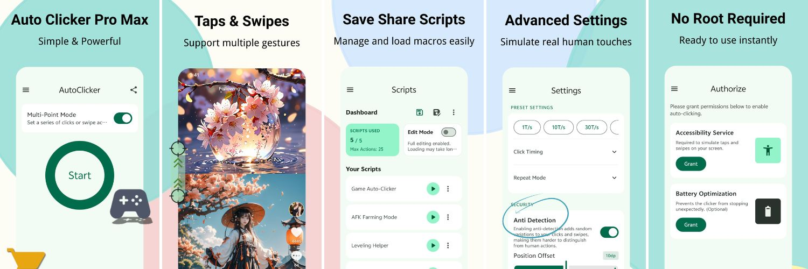

# 🎮 Auto Clicker Fast - Official Guides & Scripts

> **The ultimate high-performance automation suite for Android 16.** Optimized for zero-lag UI, 100% offline privacy, and complex game macros. No root required.

---

## 🚀 Why Auto Clicker Fast?

In our latest **v1.0.8** update, we've overhauled the core engine to solve critical performance and privacy issues:

* **Zero-Lag UI Execution**: We optimized the "drag-to-censor" logic to execute only upon release, drastically reducing UI thread pressure and fixing the **Frozen Frames** issue (77% improvement based on Vitals data).
* **100% Offline Privacy**: Our face recognition and censoring libraries are now entirely **offline**. No data leaves your device, ensuring maximum security with a smaller APK size.
* **Android 16 Ready**: Fully compatible with the latest system APIs and Google's native translation engine for a seamless experience.
* **Built with Jetpack Compose**: A modern, fluent interface designed for efficiency and low battery consumption.

---

## 📖 Resources & Community

Join our community to get the most out of your automation experience:

* 🎮 **[Game Specific Scripts](https://github.com/autoclickerfast/auto-clicker-guides/discussions/categories/game-scripts-configs)**: Download verified macros for popular games like *Roblox*, *Coin Master*, and *TikTok*.
* 🛠️ **[Performance Tuning Guides](https://github.com/autoclickerfast/auto-clicker-guides/discussions/categories/how-to-guides)**: Learn how to optimize your settings to bypass lag and improve stability.
* 💡 **[Wiki Documentation](https://github.com/autoclickerfast/auto-clicker-guides/wiki)**: Comprehensive guides on advanced macro editing and multi-point actions.

---

## 🛠️ Advanced Features

* **Custom Macros**: Design and save complex action sequences with our intuitive editor.
* **Multi-Point & Simultaneous Actions**: Execute multiple taps or swipes at the exact same time.
* **Precision Control**: Fine-tune frequency, duration, and random offsets to simulate human interaction.
* **Accessibility Aid**: An essential tool for developers testing UIs or as an assistive aid for users with motor impairments.

---

## 🔒 Privacy & Security

We take your privacy seriously. **Auto Clicker Fast** requires the **Accessibility Services API** to perform clicks and swipes. 
* **No Data Collection**: We never collect or share personal data.
* **Offline First**: All ML-based features (like face detection) process 100% locally on your device.

---

### 📥 [Download Free on Google Play](https://play.google.com/store/apps/details?id=com.itdragon.autoclickerfree)

*Developed by itdragon | 100% Free | No Root Needed*

